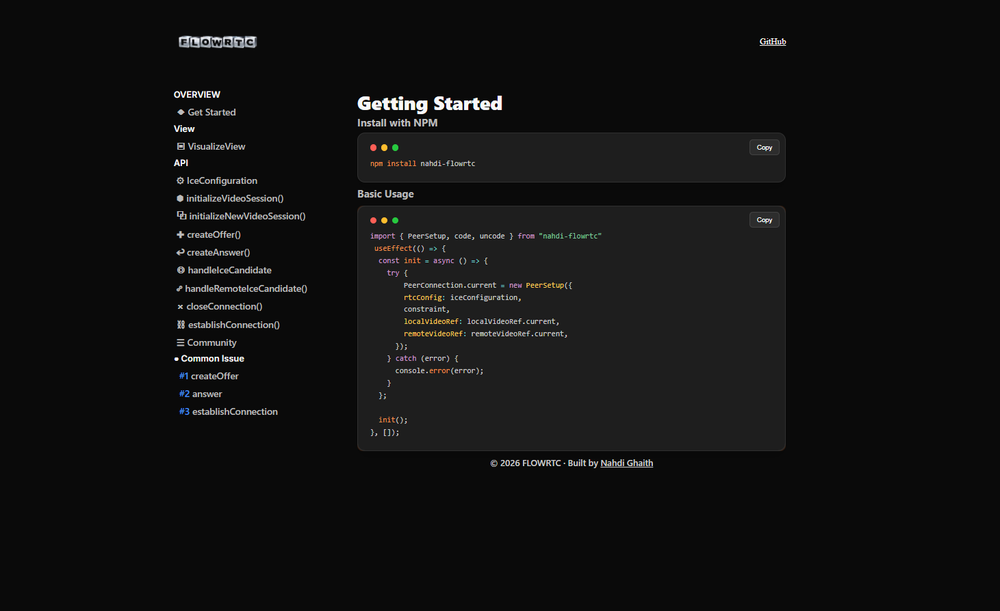

# 🚀 PeerSetup

> Lightweight, event-driven WebRTC helper for seamless browser-to-browser video connections.

PeerSetup abstracts WebRTC complexity and gives you a clean, predictable API to build real-time communication apps faster.

---

## 📦 Badges


---

## 🎯 Why PeerSetup?

WebRTC is powerful — but complex.

PeerSetup handles the heavy lifting:

- 📷 Camera & microphone initialization  
- 🔄 Offer / Answer negotiation  
- ❄️ ICE candidate buffering  
- 🎬 Local & remote media stream handling  
- 🧹 Graceful connection cleanup  
- 📡 Event-driven signaling structure  

You focus on your app logic.  
PeerSetup handles the WebRTC plumbing.

---

## ✨ Features

- ⚡ Simple API built on native WebRTC  
- 🧩 Custom event system (`on`, `off`, `emit`)  
- 🪶 Lightweight & framework agnostic  
- 🔒 No external dependencies  
- 📦 MIT Licensed  
- 🧠 Clean internal architecture  

---

## 📖 Documentation Preview

<p align="center">
  
</p>

<p align="center">
  
</p>

---

## 🛠 Installation

```bash
npm install nahdi-flowrtc
```

or

```bash
yarn add nahdi-flowrtc
```

---

## 🚀 Quick Start

### 1️⃣ Import

```js
import { PeerSetup } from "nahdi-flowrtc";
```

---

### 2️⃣ Initialize

```js
const peer = new PeerSetup({
  localVideoRef: document.getElementById("localVideo"),
  remoteVideoRef: document.getElementById("remoteVideo"),
  constraint: { video: true, audio: true }
});
```

---

### 3️⃣ Listen To Events

```js
// ICE Candidate
peer.on("candidate", (candidate) => {
  // Send candidate to your signaling server
});

// Remote Description
peer.on("RemoteDescription", (remote) => {
  console.log(remote);
  // Expected:
  // "Succes-RemoteDescription"
});
```

---

## 🔄 Typical Connection Flow

```
1. Create PeerSetup instance
2. Create Offer
3. Send Offer to signaling server
4. Receive Answer
5. Exchange ICE Candidates
6. 🎉 Peer connection established
```

---

## 🧩 Event System

```js
peer.on(eventName, callback)
peer.off(eventName, callback)
peer.emit(eventName, data)
```

---

## 🏗 Architecture Philosophy

PeerSetup is designed with:

- Clear separation of concerns  
- Minimal abstraction  
- Native WebRTC compliance  
- Predictable lifecycle handling  

No magic.  
No hidden behaviors.  
Just clean WebRTC logic.

---

## 📌 Use Cases

Perfect for:

- 📹 Video chat applications  
- 🧑‍💻 Collaboration tools  
- 🎮 Browser P2P games  
- 📡 Real-time streaming tools  
- 📲 Web-based calling platforms  

---

## 🤝 Contributing

Contributions are welcome.

1. Fork the repository  
2. Create a new branch  
3. Commit your changes  
4. Submit a pull request  

---

## 📄 License

MIT License  
Free for commercial and personal use.

---

## ⭐ Support The Project

If you like this library:

- Give it a ⭐ on GitHub  
- Share it with developers  
- Use it in your next real-time app  

🔥 Built for modern real-time web apps.
